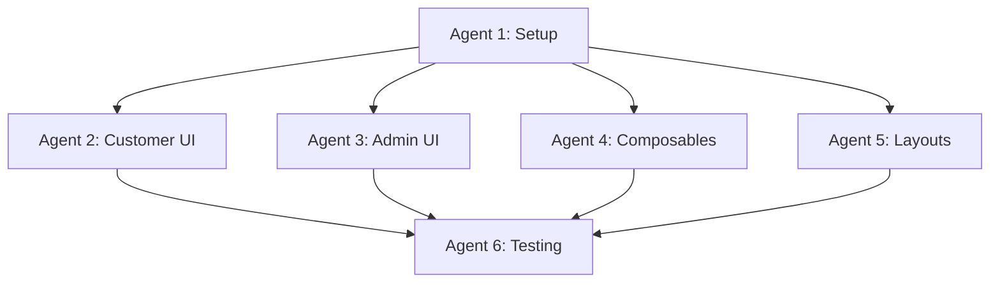

# Nuxt 3 Migration Plan - Pension Guidance Chat Application

**Date Created**: November 2, 2025
**Objective**: Migrate Vue 3 + Vite app to Nuxt 3 with AI SDK UI (chat) + Nuxt UI 4 (admin)
**Estimated Time**: 2-3 hours with parallel agent execution
**Complexity**: Medium-High

---

## 📋 Current State Analysis

### Current Architecture
```
frontend/
├── src/
│   ├── assets/styles/          # CSS custom properties
│   ├── components/
│   │   ├── base/               # 4 components (Button, Card, Input, Badge)
│   │   ├── chat/               # 6 components (ChatContainer, ChatMessage, etc.)
│   │   ├── consultations/      # 3 components (ConsultationCard, FilterTabs, etc.)
│   │   ├── admin/              # 5 components (MetricCard, LineChart, etc.)
│   │   ├── forms/              # 1 component (CustomerProfileForm)
│   │   └── common/             # 2 components (LoadingState, Toast)
│   ├── composables/            # 4 composables (useChat, useConsultation, etc.)
│   ├── layouts/                # 3 layouts (AppLayout, ChatLayout, AdminLayout)
│   ├── views/                  # 5 views
│   ├── router/                 # Vue Router
│   ├── stores/                 # Pinia stores
│   ├── types/                  # TypeScript types
│   └── utils/                  # API client
├── package.json                # Vite + Vue 3
├── vite.config.ts
└── tailwind.config.js          # Tailwind v4
```

### Current Dependencies
```json
{
  "vue": "^3.4.0",
  "vue-router": "^4.2.5",
  "pinia": "^2.1.7",
  "axios": "^1.13.1",
  "chart.js": "^4.5.1",
  "vue-chartjs": "^5.3.2",
  "tailwindcss": "^4.1.16"
}
```

---

## 🎯 Target Architecture

### Nuxt 3 Structure
```
frontend/
├── nuxt.config.ts              # Nuxt configuration
├── app.vue                     # Root component
├── components/                 # Auto-imported components
│   ├── chat/                   # AI SDK UI components
│   ├── admin/                  # Nuxt UI 4 components
│   └── forms/
├── composables/                # Auto-imported composables
├── layouts/                    # Nuxt layouts
├── pages/                      # File-based routing (was views/)
│   ├── index.vue               # Home
│   ├── consultation/
│   │   └── [id].vue            # Chat (dynamic route)
│   ├── history.vue             # Consultation history
│   └── admin/
│       ├── index.vue           # Dashboard
│       └── consultations/
│           └── [id].vue        # Review
├── server/                     # NEW - Nuxt server routes
│   └── api/                    # Proxy to FastAPI
├── stores/                     # Pinia (auto-imported)
├── types/
└── utils/
```

### New Dependencies
```json
{
  "nuxt": "^3.15.0",
  "@nuxt/ui": "^4.0.0",          // Nuxt UI 4
  "@ai-sdk/vue": "^0.0.x",       // AI SDK UI for Vue
  "ai": "^3.x.x",                // Vercel AI SDK
  "pinia": "^2.1.7",             // Still used
  "@pinia/nuxt": "^0.5.0",       // Nuxt integration
  "@nuxtjs/tailwindcss": "^6.x", // Nuxt Tailwind module
  "chart.js": "^4.5.1",
  "vue-chartjs": "^5.3.2"
}
```

---

## 🤖 Agent Task Breakdown

### **AGENT 1: Nuxt Setup & Configuration** (30 min)
**Priority**: CRITICAL - Must complete first
**Skills**: Nuxt, TypeScript, Build Tools

#### Tasks:
1. **Initialize Nuxt 3 project** in new `frontend-nuxt/` directory
   ```bash
   npx nuxi@latest init frontend-nuxt
   cd frontend-nuxt
   ```

2. **Install dependencies**
   ```bash
   npm install @nuxt/ui @ai-sdk/vue ai pinia @pinia/nuxt
   npm install chart.js vue-chartjs
   npm install -D @nuxtjs/tailwindcss
   ```

3. **Configure `nuxt.config.ts`**
   ```typescript
   export default defineNuxtConfig({
     modules: [
       '@nuxt/ui',
       '@pinia/nuxt',
       '@nuxtjs/tailwindcss'
     ],

     runtimeConfig: {
       public: {
         apiBase: process.env.NUXT_PUBLIC_API_BASE || 'http://localhost:8000'
       }
     },

     typescript: {
       strict: true,
       typeCheck: true
     },

     // Proxy API requests to FastAPI
     nitro: {
       devProxy: {
         '/api': {
           target: 'http://localhost:8000',
           changeOrigin: true
         }
       }
     },

     app: {
       head: {
         title: 'Pension Guidance Service',
         link: [
           {
             rel: 'stylesheet',
             href: 'https://fonts.googleapis.com/css2?family=Inter:wght@400;500;600;700&family=Fira+Code&display=swap'
           }
         ]
       }
     }
   })
   ```

4. **Copy design tokens** to `assets/css/design-tokens.css`

5. **Create `app.vue`**
   ```vue
   <template>
     <NuxtLayout>
       <NuxtPage />
     </NuxtLayout>
   </template>
   ```

**Deliverables**:
- ✅ Working Nuxt 3 project
- ✅ All dependencies installed
- ✅ Configuration complete
- ✅ Dev server running on port 3000

**Validation**:
```bash
npm run dev
# Should see: Nuxt 3 running at http://localhost:3000
```

---

### **AGENT 2: Customer UI Migration (AI SDK UI)** (45 min)
**Priority**: HIGH
**Dependencies**: Agent 1 complete
**Skills**: Vue 3, AI SDK, Streaming UIs

#### Tasks:

1. **Migrate pages/**
   - Copy `views/Home.vue` → `pages/index.vue`
   - Copy `views/Chat.vue` → `pages/consultation/[id].vue`
   - Copy `views/ConsultationHistory.vue` → `pages/history.vue`
   - Update all imports to use Nuxt auto-imports

2. **Create AI SDK UI chat component**

   **File**: `components/chat/AIChat.vue`
   ```vue
   <template>
     <div class="flex flex-col h-full">
       <!-- Messages -->
       <div ref="messagesRef" class="flex-1 overflow-y-auto p-4 space-y-4">
         <div
           v-for="message in messages"
           :key="message.id"
           :class="[
             'flex',
             message.role === 'user' ? 'justify-end' : 'justify-start'
           ]"
         >
           <div
             :class="[
               'max-w-[70%] rounded-lg p-4',
               message.role === 'user'
                 ? 'bg-primary-100 text-primary-900'
                 : 'bg-secondary-100 text-gray-900'
             ]"
           >
             <div class="prose prose-sm" v-html="markdown(message.content)" />

             <!-- Compliance Badge for Advisor -->
             <div
               v-if="message.role === 'assistant' && message.metadata?.compliance"
               class="mt-2 text-xs text-gray-600"
             >
               <UIcon name="i-heroicons-shield-check" class="w-4 h-4 inline" />
               {{ (message.metadata.compliance * 100).toFixed(0) }}% Compliant
             </div>
           </div>
         </div>

         <!-- Streaming Indicator -->
         <div v-if="isLoading" class="flex justify-start">
           <div class="bg-secondary-100 rounded-lg p-4">
             <UIcon name="i-heroicons-ellipsis-horizontal" class="w-5 h-5 animate-pulse" />
           </div>
         </div>
       </div>

       <!-- Input -->
       <div class="border-t border-gray-200 p-4">
         <form @submit.prevent="handleSubmit" class="flex gap-2">
           <UTextarea
             v-model="input"
             :disabled="isLoading"
             placeholder="Type your message..."
             :rows="1"
             autoresize
             class="flex-1"
           />
           <UButton
             type="submit"
             :disabled="!input.trim() || isLoading"
             icon="i-heroicons-paper-airplane"
             size="lg"
           />
         </form>
       </div>
     </div>
   </template>

   <script setup lang="ts">
   import { useChat } from '@ai-sdk/vue'
   import { marked } from 'marked'

   const props = defineProps<{
     consultationId: string
   }>()

   const messagesRef = ref<HTMLDivElement>()

   // AI SDK useChat hook
   const { messages, input, handleSubmit, isLoading } = useChat({
     api: `/api/consultations/${props.consultationId}/chat`,
     onFinish: (message) => {
       // Scroll to bottom
       nextTick(() => {
         messagesRef.value?.scrollTo({
           top: messagesRef.value.scrollHeight,
           behavior: 'smooth'
         })
       })
     }
   })

   const markdown = (text: string) => marked.parse(text)
   </script>
   ```

3. **Update consultation page**

   **File**: `pages/consultation/[id].vue`
   ```vue
   <template>
     <div class="h-screen flex flex-col">
       <!-- Header -->
       <header class="bg-white border-b border-gray-200 p-4">
         <div class="flex items-center justify-between max-w-7xl mx-auto">
           <NuxtLink to="/" class="flex items-center gap-2 text-primary-700 hover:text-primary-900">
             <UIcon name="i-heroicons-arrow-left" />
             <span>Back to Home</span>
           </NuxtLink>

           <h1 class="text-lg font-semibold">Consultation with Sarah</h1>

           <UDropdown :items="menuItems">
             <UButton icon="i-heroicons-ellipsis-vertical" variant="ghost" />
           </UDropdown>
         </div>
       </header>

       <!-- Advisor Header -->
       <div class="bg-white border-b border-gray-200 p-4">
         <div class="flex items-center gap-3 max-w-7xl mx-auto">
           <UAvatar
             src="/advisor-avatar.png"
             alt="Sarah"
             size="md"
           />
           <div>
             <div class="font-semibold">Sarah</div>
             <div class="text-sm text-gray-600">Pension Guidance Specialist</div>
           </div>
           <UBadge color="green" variant="soft">
             Active
           </UBadge>
         </div>
       </div>

       <!-- Chat Component -->
       <div class="flex-1 overflow-hidden">
         <ChatAIChat :consultation-id="id" />
       </div>
     </div>
   </template>

   <script setup lang="ts">
   const route = useRoute()
   const id = route.params.id as string

   const menuItems = [
     [{
       label: 'Export Transcript',
       icon: 'i-heroicons-document-arrow-down'
     }],
     [{
       label: 'End Consultation',
       icon: 'i-heroicons-x-mark',
       color: 'red'
     }]
   ]
   </script>
   ```

4. **Migrate CustomerProfileForm with Nuxt UI**

   **File**: `components/forms/CustomerProfileForm.vue`
   ```vue
   <template>
     <UCard>
       <template #header>
         <div class="text-center">
           <div class="text-4xl mb-4">💬</div>
           <h2 class="text-2xl font-semibold">Start Your Pension Guidance Consultation</h2>
           <p class="text-gray-600 mt-2">
             Get personalized guidance on your pension options in a safe, confidential environment.
           </p>
         </div>
       </template>

       <UForm :state="form" @submit="onSubmit" class="space-y-6">
         <UFormGroup label="First Name" required>
           <UInput
             v-model="form.firstName"
             placeholder="Enter your first name"
           />
         </UFormGroup>

         <UFormGroup label="Age" required>
           <UInput
             v-model.number="form.age"
             type="number"
             placeholder="Enter your age"
             :min="18"
             :max="120"
           />
         </UFormGroup>

         <UFormGroup label="What brings you here today?" required>
           <URadioGroup v-model="form.topic" :options="topicOptions" />
         </UFormGroup>

         <UButton
           type="submit"
           size="xl"
           block
           :loading="loading"
         >
           Start Consultation
         </UButton>
       </UForm>
     </UCard>
   </template>

   <script setup lang="ts">
   const router = useRouter()
   const loading = ref(false)

   const form = reactive({
     firstName: '',
     age: null as number | null,
     topic: ''
   })

   const topicOptions = [
     { value: 'consolidation', label: 'Consolidating pensions' },
     { value: 'withdrawal', label: 'Considering pension withdrawal' },
     { value: 'understanding', label: 'Understanding my options' },
     { value: 'tax', label: 'Tax implications' },
     { value: 'other', label: 'Other' }
   ]

   const onSubmit = async () => {
     loading.value = true
     try {
       const { data } = await useFetch('/api/customers/profile', {
         method: 'POST',
         body: form
       })
       router.push(`/consultation/${data.value.id}`)
     } finally {
       loading.value = false
     }
   }
   </script>
   ```

**Deliverables**:
- ✅ AI SDK UI integrated for chat
- ✅ Streaming messages working
- ✅ Customer profile form with Nuxt UI
- ✅ All customer-facing pages migrated

**Validation**:
- Chat interface shows streaming messages
- Form validation works
- Navigation between pages works

---

### **AGENT 3: Admin UI Migration (Nuxt UI 4)** (45 min)
**Priority**: HIGH
**Dependencies**: Agent 1 complete
**Skills**: Nuxt UI, Data Visualization, Admin Dashboards

#### Tasks:

1. **Migrate admin pages**
   - Copy `views/admin/Dashboard.vue` → `pages/admin/index.vue`
   - Copy `views/admin/ConsultationReview.vue` → `pages/admin/consultations/[id].vue`

2. **Create Admin Dashboard with Nuxt UI**

   **File**: `pages/admin/index.vue`
   ```vue
   <template>
     <div>
       <div class="mb-6">
         <h1 class="text-3xl font-bold">Admin Dashboard</h1>
       </div>

       <!-- Key Metrics -->
       <div class="grid grid-cols-1 md:grid-cols-3 gap-6 mb-8">
         <UCard>
           <template #header>
             <div class="flex items-center justify-between">
               <span class="text-sm font-medium text-gray-600">Consultations</span>
               <UIcon name="i-heroicons-chart-bar" class="w-5 h-5 text-primary-500" />
             </div>
           </template>
           <div>
             <div class="text-4xl font-bold">1,247</div>
             <div class="flex items-center gap-1 mt-2 text-sm text-success-600">
               <UIcon name="i-heroicons-arrow-trending-up" class="w-4 h-4" />
               <span>+12%</span>
             </div>
           </div>
         </UCard>

         <UCard>
           <template #header>
             <div class="flex items-center justify-between">
               <span class="text-sm font-medium text-gray-600">Compliance</span>
               <UIcon name="i-heroicons-shield-check" class="w-5 h-5 text-success-500" />
             </div>
           </template>
           <div>
             <div class="text-4xl font-bold">96.4%</div>
             <div class="flex items-center gap-1 mt-2 text-sm text-success-600">
               <UIcon name="i-heroicons-arrow-trending-up" class="w-4 h-4" />
               <span>+1.2%</span>
             </div>
           </div>
         </UCard>

         <UCard>
           <template #header>
             <div class="flex items-center justify-between">
               <span class="text-sm font-medium text-gray-600">Satisfaction</span>
               <UIcon name="i-heroicons-star" class="w-5 h-5 text-warning-500" />
             </div>
           </template>
           <div>
             <div class="text-4xl font-bold">4.2/5.0</div>
             <div class="text-sm text-gray-600 mt-2">Average rating</div>
           </div>
         </UCard>
       </div>

       <!-- Chart -->
       <UCard class="mb-8">
         <template #header>
           <h2 class="text-xl font-semibold">Compliance Over Time</h2>
         </template>
         <LineChart :data="complianceData" :height="300" />
       </UCard>

       <!-- Recent Consultations Table -->
       <UCard>
         <template #header>
           <div class="flex items-center justify-between">
             <h2 class="text-xl font-semibold">Recent Consultations</h2>
             <div class="flex gap-2">
               <UButton variant="outline" icon="i-heroicons-funnel">Filters</UButton>
               <UButton variant="outline" icon="i-heroicons-arrow-down-tray">Export</UButton>
             </div>
           </div>
         </template>

         <UTable
           :columns="columns"
           :rows="consultations"
           @select="handleView"
         >
           <template #compliance-data="{ row }">
             <UBadge
               :color="row.compliance >= 95 ? 'green' : row.compliance >= 85 ? 'yellow' : 'red'"
               variant="soft"
             >
               {{ row.compliance }}%
             </UBadge>
           </template>

           <template #satisfaction-data="{ row }">
             <div class="flex items-center gap-1">
               <span>{{ row.satisfactionEmoji }}</span>
               <span class="text-sm">{{ row.satisfactionText }}</span>
             </div>
           </template>

           <template #actions-data="{ row }">
             <UButton
               size="xs"
               @click="handleView(row)"
             >
               View
             </UButton>
           </template>
         </UTable>
       </UCard>
     </div>
   </template>

   <script setup lang="ts">
   definePageMeta({
     layout: 'admin'
   })

   const router = useRouter()

   const columns = [
     { key: 'id', label: 'ID' },
     { key: 'customer', label: 'Customer' },
     { key: 'topic', label: 'Topic' },
     { key: 'date', label: 'Date' },
     { key: 'messages', label: 'Messages' },
     { key: 'compliance', label: 'Compliance' },
     { key: 'satisfaction', label: 'Satisfaction' },
     { key: 'actions', label: '' }
   ]

   const { data: consultations } = await useFetch('/api/admin/consultations')
   const { data: complianceData } = await useFetch('/api/admin/metrics/compliance')

   const handleView = (row: any) => {
     router.push(`/admin/consultations/${row.id}`)
   }
   </script>
   ```

3. **Create Admin Layout**

   **File**: `layouts/admin.vue`
   ```vue
   <template>
     <div class="min-h-screen bg-gray-50">
       <!-- Sidebar -->
       <aside class="fixed inset-y-0 left-0 w-64 bg-white border-r border-gray-200">
         <div class="p-6">
           <h2 class="text-xl font-bold">Admin</h2>
         </div>

         <nav class="px-4 space-y-1">
           <UButton
             to="/admin"
             variant="ghost"
             block
             justify="start"
             icon="i-heroicons-chart-bar"
           >
             Consultations
           </UButton>
           <UButton
             to="/admin/metrics"
             variant="ghost"
             block
             justify="start"
             icon="i-heroicons-chart-pie"
           >
             Metrics
           </UButton>
           <UButton
             to="/admin/settings"
             variant="ghost"
             block
             justify="start"
             icon="i-heroicons-cog-6-tooth"
           >
             Settings
           </UButton>
         </nav>
       </aside>

       <!-- Main Content -->
       <div class="pl-64">
         <header class="bg-white border-b border-gray-200 p-4">
           <div class="flex items-center justify-between">
             <h1 class="text-2xl font-bold">Admin Dashboard</h1>
             <UButton variant="ghost" icon="i-heroicons-arrow-left-on-rectangle" to="/">
               Exit Admin
             </UButton>
           </div>
         </header>

         <main class="p-6">
           <slot />
         </main>
       </div>
     </div>
   </template>
   ```

4. **Create Consultation Review Page**

   **File**: `pages/admin/consultations/[id].vue`
   ```vue
   <template>
     <div>
       <div class="mb-6">
         <UButton
           to="/admin"
           variant="ghost"
           icon="i-heroicons-arrow-left"
         >
           Back to Dashboard
         </UButton>
         <h1 class="text-3xl font-bold mt-4">Consultation Review: {{ id }}</h1>
       </div>

       <div class="grid grid-cols-1 lg:grid-cols-4 gap-6">
         <!-- Overview Sidebar -->
         <div class="lg:col-span-1">
           <UCard>
             <template #header>
               <h2 class="text-xl font-semibold">Overview</h2>
             </template>

             <div class="space-y-4">
               <div>
                 <div class="text-sm font-medium text-gray-600">Customer</div>
                 <div class="text-base">{{ consultation.customer }}</div>
               </div>

               <div>
                 <div class="text-sm font-medium text-gray-600">Age</div>
                 <div class="text-base">{{ consultation.age }}</div>
               </div>

               <div>
                 <div class="text-sm font-medium text-gray-600">Compliance</div>
                 <UMeter
                   :value="consultation.compliance * 100"
                   :max="100"
                   color="green"
                 />
                 <div class="text-sm mt-1">{{ (consultation.compliance * 100).toFixed(1) }}%</div>
               </div>

               <div class="pt-4 space-y-2">
                 <UButton block icon="i-heroicons-document-arrow-down">
                   Export PDF
                 </UButton>
                 <UButton block variant="outline" icon="i-heroicons-folder-plus">
                   Add to Cases
                 </UButton>
               </div>
             </div>
           </UCard>
         </div>

         <!-- Transcript -->
         <div class="lg:col-span-2">
           <UCard>
             <template #header>
               <h2 class="text-xl font-semibold">Conversation Transcript</h2>
             </template>

             <div class="space-y-4">
               <div
                 v-for="(turn, index) in consultation.transcript"
                 :key="index"
                 class="border-l-4 pl-4"
                 :class="turn.isAdvisor ? 'border-orange-500' : 'border-blue-500'"
               >
                 <div class="flex items-center justify-between mb-2">
                   <span class="text-sm font-semibold">
                     {{ turn.isAdvisor ? 'Advisor' : 'Customer' }} - Turn {{ turn.turn }}
                   </span>
                   <span class="text-xs text-gray-600">{{ turn.timestamp }}</span>
                 </div>

                 <p class="text-gray-900 mb-2">"{{ turn.content }}"</p>

                 <div v-if="turn.complianceScore" class="flex items-center gap-2">
                   <UBadge
                     :color="turn.complianceScore >= 0.95 ? 'green' : 'yellow'"
                     variant="soft"
                   >
                     {{ (turn.complianceScore * 100).toFixed(0) }}%
                   </UBadge>
                   <span class="text-xs text-gray-600">
                     (confidence: {{ (turn.complianceScore * 100).toFixed(0) }}%)
                   </span>
                 </div>
               </div>
             </div>
           </UCard>
         </div>

         <!-- Learning Insights -->
         <div class="lg:col-span-1">
           <UCard>
             <template #header>
               <h2 class="text-xl font-semibold">Learning Insights</h2>
             </template>

             <div class="space-y-4">
               <div>
                 <div class="text-sm font-medium text-gray-600 mb-2">Retrieved Cases</div>
                 <div class="text-sm">{{ consultation.insights.cases }} relevant past consultations</div>
               </div>

               <div>
                 <div class="text-sm font-medium text-gray-600 mb-2">Applied Rules</div>
                 <ul class="space-y-1">
                   <li
                     v-for="rule in consultation.insights.rules"
                     :key="rule"
                     class="text-sm text-gray-900"
                   >
                     "{{ rule }}"
                   </li>
                 </ul>
               </div>
             </div>
           </UCard>
         </div>
       </div>
     </div>
   </template>

   <script setup lang="ts">
   definePageMeta({
     layout: 'admin'
   })

   const route = useRoute()
   const id = route.params.id as string

   const { data: consultation } = await useFetch(`/api/admin/consultations/${id}`)
   </script>
   ```

**Deliverables**:
- ✅ Nuxt UI 4 integrated for admin
- ✅ Admin dashboard with metrics
- ✅ Data table with Nuxt UI
- ✅ Consultation review page
- ✅ Admin layout with sidebar

**Validation**:
- Admin dashboard loads with metrics
- Table sorting/filtering works
- Consultation review shows transcript

---

### **AGENT 4: Composables & Stores Migration** (30 min)
**Priority**: MEDIUM
**Dependencies**: Agent 1 complete
**Skills**: Vue Composition API, Pinia

#### Tasks:

1. **Migrate composables** to `composables/`
   - All files in `src/composables/` → `composables/`
   - Remove explicit imports (Nuxt auto-imports)
   - Update to use `useFetch` instead of axios

2. **Update `useChat.ts` for AI SDK**
   ```typescript
   // composables/useChat.ts
   import { useChat as useAIChat } from '@ai-sdk/vue'

   export const useChat = (consultationId: string) => {
     const config = useRuntimeConfig()

     return useAIChat({
       api: `${config.public.apiBase}/api/consultations/${consultationId}/chat`,
       onResponse: (response) => {
         // Track analytics
         console.log('Message received:', response)
       },
       onError: (error) => {
         // Handle errors
         console.error('Chat error:', error)
       }
     })
   }
   ```

3. **Migrate Pinia stores** to `stores/`
   - Copy all store files
   - Update to use Nuxt auto-imports

4. **Create API utility** using `$fetch`
   ```typescript
   // utils/api.ts
   export const api = {
     consultations: {
       list: () => $fetch('/api/consultations'),
       get: (id: string) => $fetch(`/api/consultations/${id}`),
       create: (data: any) => $fetch('/api/consultations', {
         method: 'POST',
         body: data
       })
     },
     admin: {
       metrics: () => $fetch('/api/admin/metrics'),
       consultations: () => $fetch('/api/admin/consultations')
     }
   }
   ```

**Deliverables**:
- ✅ All composables migrated
- ✅ Pinia stores working
- ✅ API client updated
- ✅ Auto-imports configured

---

### **AGENT 5: Layouts & Common Components** (30 min)
**Priority**: MEDIUM
**Dependencies**: Agent 1 complete
**Skills**: Vue Components, Nuxt Layouts

#### Tasks:

1. **Migrate layouts** to `layouts/`
   - Create `layouts/default.vue`
   - Create `layouts/admin.vue` (already done by Agent 3)
   - Create `layouts/chat.vue` if needed

2. **Create default layout**
   ```vue
   <!-- layouts/default.vue -->
   <template>
     <div class="min-h-screen bg-gray-100">
       <header class="bg-white shadow-sm">
         <div class="max-w-7xl mx-auto px-4 py-4">
           <div class="flex items-center justify-between">
             <NuxtLink to="/" class="text-2xl font-bold">
               Pension Guidance Service
             </NuxtLink>
             <nav class="flex gap-4">
               <UButton variant="ghost" to="/history">History</UButton>
               <UButton variant="ghost">Help</UButton>
               <UButton variant="outline">Sign Out</UButton>
             </nav>
           </div>
         </div>
       </header>

       <main class="max-w-7xl mx-auto px-4 py-8">
         <slot />
       </main>
     </div>
   </template>
   ```

3. **Create common components**
   - `components/common/LoadingState.vue` with Nuxt UI
   - `components/common/ErrorState.vue`
   - Update Toast to use Nuxt UI notifications

**Deliverables**:
- ✅ All layouts migrated
- ✅ Common components updated
- ✅ Navigation working

---

### **AGENT 6: Testing & Validation** (30 min)
**Priority**: LOW (runs after all others)
**Dependencies**: Agents 1-5 complete
**Skills**: Testing, QA

#### Tasks:

1. **Run build test**
   ```bash
   npm run build
   ```

2. **Test all routes**
   - `/` - Home page loads
   - `/consultation/[id]` - Chat interface works
   - `/history` - Consultation history displays
   - `/admin` - Dashboard loads
   - `/admin/consultations/[id]` - Review page works

3. **Verify AI SDK streaming**
   - Send message in chat
   - Verify streaming works
   - Check compliance badges appear

4. **Verify Nuxt UI components**
   - Check all buttons, cards, tables render
   - Verify colors match design system
   - Test responsive design

5. **Update documentation**
   - Update README with Nuxt commands
   - Document new project structure
   - Add Nuxt UI customization guide

**Deliverables**:
- ✅ All routes tested
- ✅ Streaming verified
- ✅ Documentation updated
- ✅ Migration complete

---

## 📦 Migration Checklist

### Pre-Migration
- [ ] Backup current `frontend/` directory
- [ ] Document current environment variables
- [ ] Test current app and take screenshots
- [ ] Commit all changes to git

### During Migration
- [ ] Agent 1: Nuxt setup complete
- [ ] Agent 2: Customer UI migrated
- [ ] Agent 3: Admin UI migrated
- [ ] Agent 4: Composables migrated
- [ ] Agent 5: Layouts migrated
- [ ] Agent 6: Testing complete

### Post-Migration
- [ ] Dev server running on port 3000
- [ ] All pages accessible
- [ ] AI SDK streaming working
- [ ] Nuxt UI components rendering
- [ ] No console errors
- [ ] Build successful
- [ ] Documentation updated
- [ ] Git commit with migration summary

---

## 🚀 Execution Strategy

### Parallel Execution (Recommended)
Run Agents 2, 3, 4, 5 in **parallel** after Agent 1 completes:



**Timeline**:
- 0:00 - 0:30: Agent 1 (Setup)
- 0:30 - 1:15: Agents 2, 3, 4, 5 (Parallel)
- 1:15 - 1:45: Agent 6 (Testing)
- **Total**: ~1 hour 45 minutes

### Sequential Execution (Safer)
If parallel execution has issues:
- Agent 1 → Agent 2 → Agent 3 → Agent 4 → Agent 5 → Agent 6
- **Total**: ~3 hours

---

## ⚠️ Known Risks & Mitigation

### Risk 1: AI SDK SSE Compatibility
**Issue**: FastAPI SSE format might not match AI SDK expectations
**Mitigation**: Create adapter in server middleware

### Risk 2: Nuxt UI Tailwind Conflicts
**Issue**: Tailwind v4 config might conflict with Nuxt UI
**Mitigation**: Use Nuxt UI's Tailwind preset

### Risk 3: Component Auto-Import Issues
**Issue**: Components might not auto-import correctly
**Mitigation**: Explicitly configure in `nuxt.config.ts`

### Risk 4: Chart.js in Nuxt
**Issue**: Chart.js might have SSR issues
**Mitigation**: Use `<ClientOnly>` wrapper

---

## 📝 Final Notes

- Keep `frontend/` directory until migration is verified
- New Nuxt app in `frontend-nuxt/`
- After verification, rename `frontend/` → `frontend-old/`
- Rename `frontend-nuxt/` → `frontend/`
- Update docker-compose.yml to use new frontend

---

## ✅ Success Criteria

Migration is successful when:
1. ✅ Nuxt dev server runs without errors
2. ✅ All 5 pages load correctly
3. ✅ AI SDK streaming works in chat
4. ✅ Nuxt UI components render properly
5. ✅ Admin dashboard displays data
6. ✅ Build completes successfully
7. ✅ No TypeScript errors
8. ✅ All E2E tests pass (if applicable)

---

**Ready to Execute?** Assign agents and start with Agent 1!
